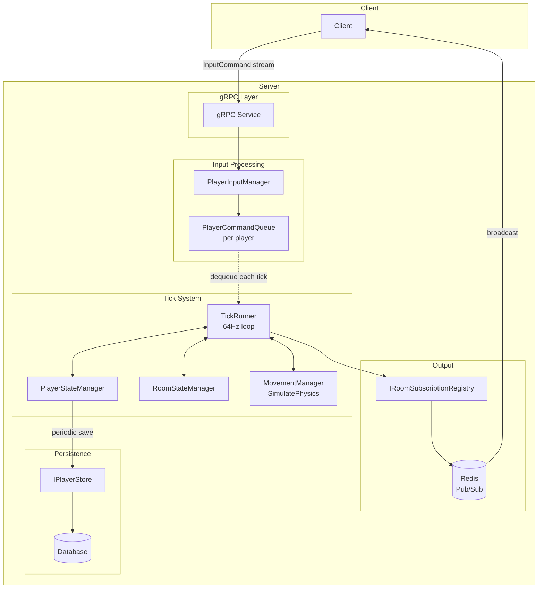
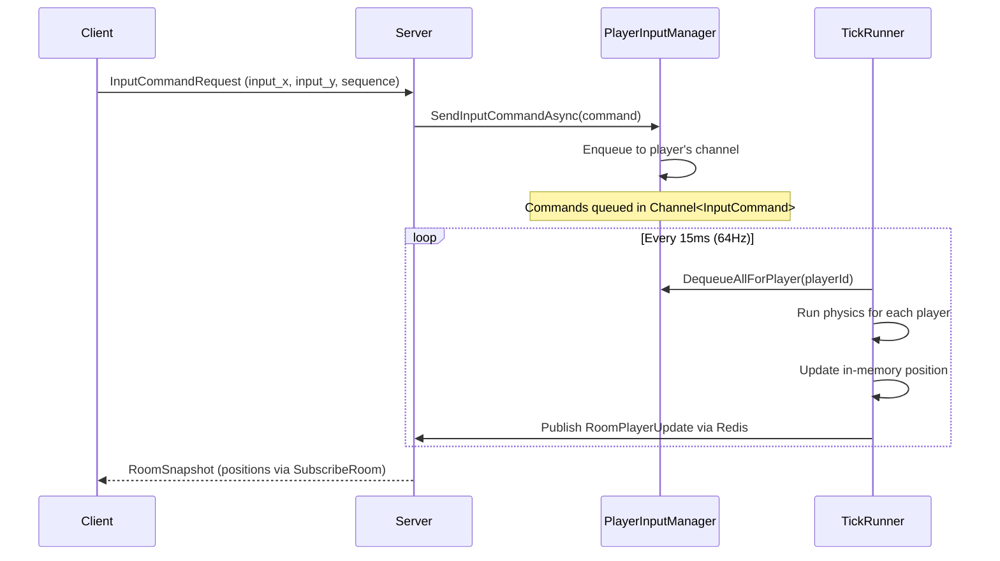
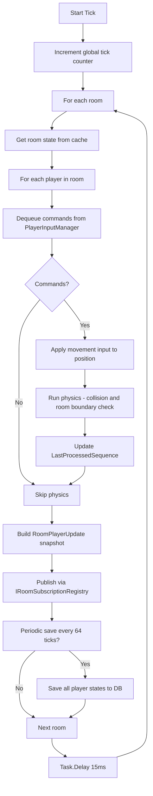

# Tick-Based Movement System Architecture

## Overview

This document describes the server-side tick-based movement system, which is very loosely based on Valve's [Source Multiplayer Networking](https://developer.valvesoftware.com/wiki/Source_Multiplayer_Networking) model

## Core Principles

1. **Server-Authoritative**: Server is the source of truth for all player positions
2. **Fixed Tick Rate**: Server runs at 64Hz (15.625ms per tick)
3. **Client-Provided Sequence**: Clients send input commands with sequence numbers for ordering
4. **In-Memory State**: Player state is kept in memory during gameplay, periodically persisted to DB

## Architecture Diagram

## Data Flow

### Input Path

### Tick Loop Flow

## Key Components

### 1. InputCommand

Client sends movement intent with:
- PlayerId
- Sequence (client-provided for ordering)
- ClientTimestamp (for RTT calculation)
- Input (MoveX, MoveY in range -1 to +1)

### 2. PlayerInputManager

- Manages command queues per player
- Each player has their own queue
- Bounded queue that drops oldest when full
- Thread-safe storage

### 3. PlayerStateManager

- In-memory storage for player states
- Tracks position, room, view angle, sequence, online status
- Provides getPlayersInRoom, addPlayerToRoom, removePlayer, updatePosition
- Handles periodic save to database

### 4. RoomStateManager

- Caches room states in memory
- Loads from DB on first access
- Avoids DB query every tick

### 5. TickRunner

- 64Hz async task loop
- Processes all rooms each tick
- Gets room state from cache
- Dequeues player commands
- Runs physics for each player
- Publishes snapshots to subscribers
- Periodic database save every 64 ticks

### 6. MovementManager.SimulatePhysics

- Sums all input commands for the tick
- Updates player position
- Checks room boundaries
- Handles room transitions if needed
- Updates DB for room changes

## Persistence Strategy

| Event | Action |
|-------|--------|
| Player spawns | Created in DB, added to PlayerStateManager |
| During gameplay | In-memory only (no DB) |
| Every 64 ticks (~1 sec) | Batch write all positions to DB |
| Room transition | Immediate DB update via SwapRoomsAsync |
| Server crash | Players resume from last saved position |

## API Contract

### SendInputCommand (gRPC)

Client sends movement input stream, server responds with Empty (positions come via SubscribeRoom).

### SubscribeRoom (gRPC)

Clients subscribe to room updates to receive position snapshots.