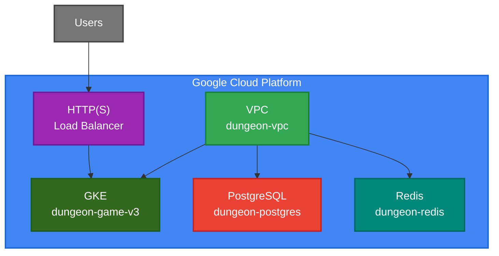

# DungeonGame

> 2D Multiplayer MMORPG built with .NET 8 and C++ (WIP)

[](https://dotnet.microsoft.com/)
[](https://grpc.io/)
[](https://www.postgresql.org/)
[](https://redis.io/)
[](https://www.docker.com/)
[](https://kubernetes.io/)

---

## Backend (DungeonServer)

Real-time authoritative multiplayer game server using gRPC streaming and Redis pub/sub

### Architecture



### Tech Stack

- **Language**: C#
- **Runtime**: ASP.NET 8
- **API**: gRPC with Protocol Buffers
- **Database**: PostgreSQL (EF Core)
- **Cache / Pub-Sub**: Redis
- **Infrastructure**: Docker

### Features

- Real-time player movement with room-to-room transitions
- Redis-backed distributed pub/sub for cross-instance state synchronization
- PostgreSQL persistence with write-through Redis caching
- gRPC streaming APIs for low-latency updates
- Containerized deployment with automatic health checks
- Built-in benchmark suite with real-time latency metrics (P50/P95/P99)

### Project Structure

```
DungeonServer/
├── Service/          # gRPC API layer
├── Application/      # Business logic & domain
├── Infrastructure/   # Database, cache, messaging implementations
├── Contracts/        # Protobuf service definitions
└── Benchmark/        # Load testing tools
```

### Getting Started

#### Docker Compose (Recommended for development)

```bash
docker compose up --build
```

Services:
- **Server**: gRPC on port 5142 (maps to internal port 8080)
- **Benchmark Dashboard**: port 9092
- **PostgreSQL**: port 5432
- **Redis**: port 6379
- **Adminer** (DB UI): port 9090
- **Redis Insight**: port 9091

#### Local Kubernetes

For a production-like Kubernetes environment locally using Kind + Helm, see [LOCAL_K8S_SETUP.md](LOCAL_K8S_SETUP.md).

---

## Client (DungeonClient)

C++ client using raylib for graphics and gRPC for networking

### Tech Stack

- **Language**: C++
- **Graphics**: raylib
- **Networking**: gRPC + Protocol Buffers
- **Package Manager**: vcpkg

### Status

Basic skeleton - not yet functional.

---

## Project Structure

```
DungeonGame/
├── DungeonServer/      # .NET 8 backend
│   ├── Service/        # API layer
│   ├── Application/    # Domain logic
│   ├── Infrastructure/ # DB, cache, messaging
│   ├── Contracts/      # Protobuf definitions
│   └── Benchmark/      # Load testing tools
├── DungeonClient/      # C++ client (WIP)
└── contracts/          # .proto files
```